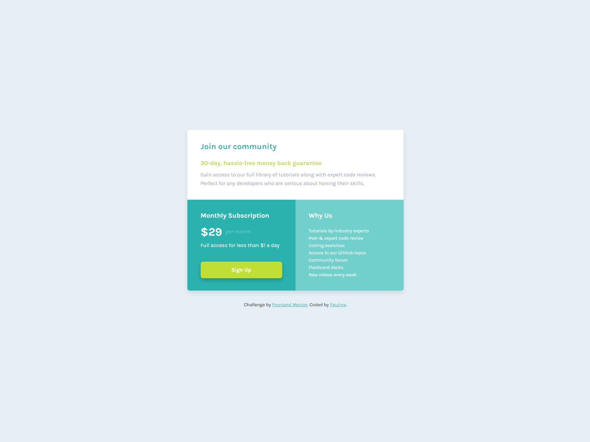

# Frontend Mentor - Single price grid component solution

This is a solution to the [Single price grid component challenge on Frontend Mentor](https://www.frontendmentor.io/challenges/single-price-grid-component-5ce41129d0ff452fec5abbbc). 

### Table of contents

  - [Overview](#overview)
  - [Screenshot](#screenshot)
  - [Link](#link)
  - [Design](#design)
  - [Built with](#built-with)

### Overview

The Single Price Grid Component is a responsive, subscription-based component built using HTML and CSS.

### The challenge

Users should be able to:

- View the optimal layout for the component depending on their device's screen size
- See a hover state on desktop for the Sign Up call-to-action

### Screenshot

### Link

- Live Site URL: (https://single-price-grid-component-pk.netlify.app/)

### Design 

I was provided with a design for this project from Frontend Mentor. The design was clear and user-friendly. I had to recreate this design and bring it to life using HTML and CSS.

### Built with

- Semantic HTML5 markup
- CSS custom properties
- Flexbox
- CSS Grid
- Mobile-first workflow

